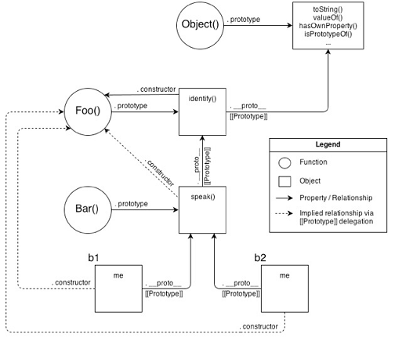

# Prototype 

Every single "object" is built by a constructor function.

A constructor makes an object `linked to` its own prototype. -Kyle Simpson

```js
function Foo(who) {
    this.me = who;
}
Foo.prototype.identify = function() {
    return "I am " + 
};

var a1 = new Foo("a1");
var a2 = new Foo("a2");

a2.speak = function(){
    alert("Hello, " + this.identify() + ".");
};

a1.constructor === Foo; 
a1.constructor === a2.constructor;
a1.__proto__ === Foo.prototype;
a1.__proto__ === a2.__proto__;
```

- Foo() has a link to an object called .prototype and the .prototype has a link that is called .constructor that points back to the Foo()
